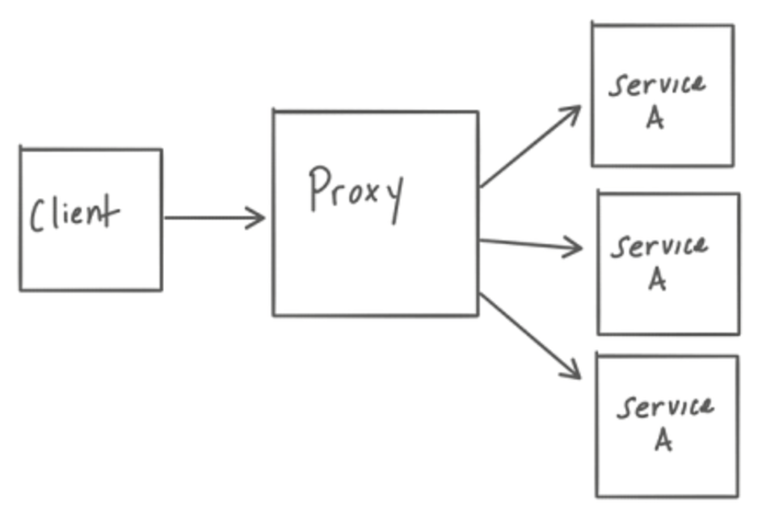
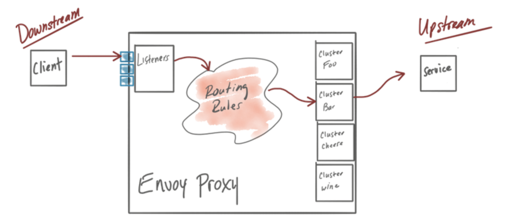
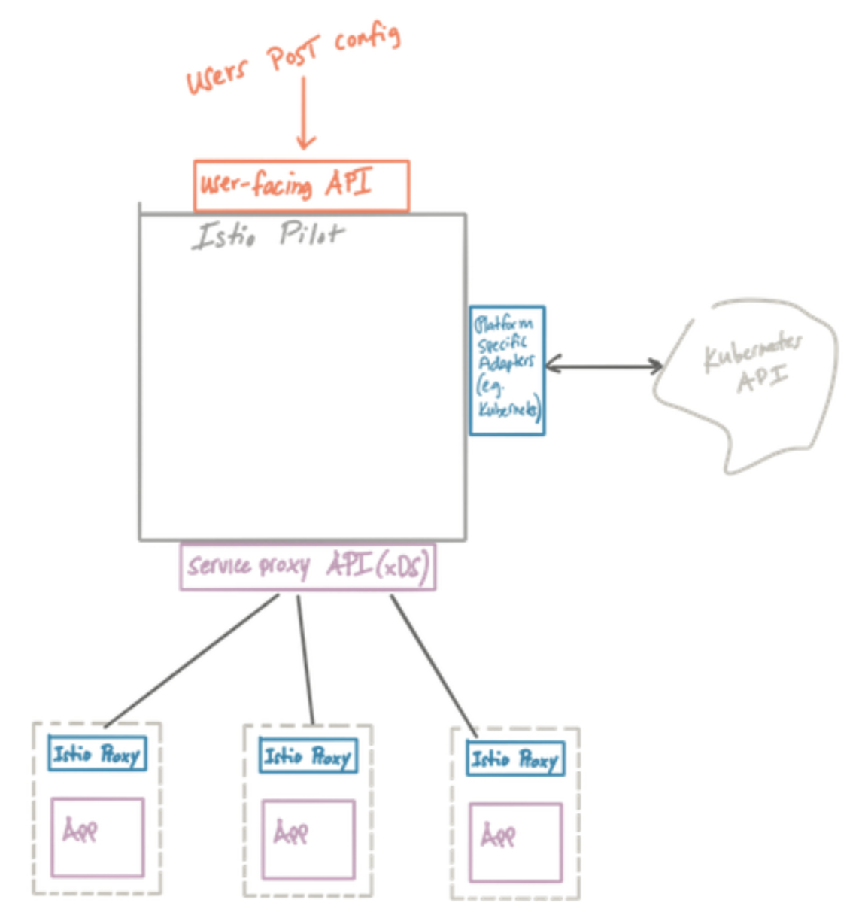
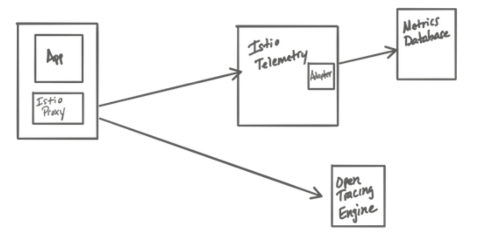
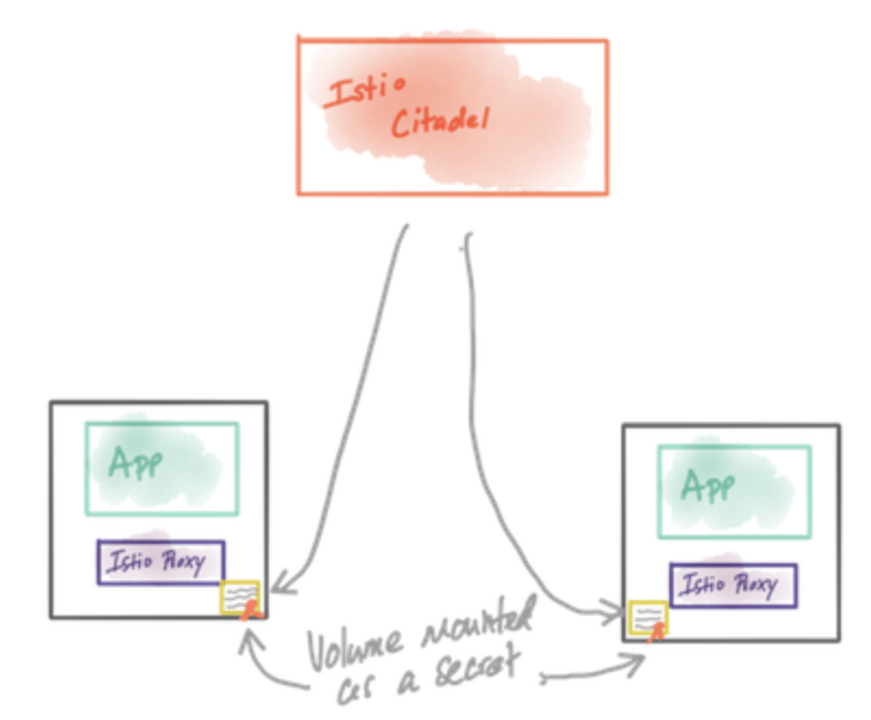

<!-- $theme: gaia -->
<!-- template: invert -->
<!-- page_number:true -->
<!-- $size: 16:9 -->

# Chapter 03
# Istio's data plane: Envoy Proxy

-----------------------------------------

<div style="font-size:75%">

## Envoy Proxy?

* 분산 시스템을 구축 할 때 발생하는 어려운 네트워킹 문제를 해결하기 위해 Lyft에서 개발.
* 아래의 중요한 두가지 원칙으로 만들어짐.
	* 네트워크는 애플리케이션에 투명해야 함.
	* 네트워크 및 응용 프로그램 문제가 발생하면 문제의 원인을 쉽게 파악할 수 있어야 함.

</div>

--------------------------------------------

<div style="font-size:75%">
  
## Proxy?



</div>

----------------------------------------------

<div style="font-size:75%">
  
## Envoy's Object

* Listeners
	* 포트를 외부 세계에 노출하여 응용 프로그램을 연결. 
	* 포트 8080의 리스너는 트래픽을 수락.
* Routes
	* Listeners 들어오는 트래픽을 처리하는 방법에 대한 규칙
	* 요청이 들어와 /catalog 와 일치하는 트래픽을 카탈로그 클러스터 전달.
* Clusters
	* Envoy가 트래픽을 전달할 수있는 특정 업스트림 서비스. 예를 들어
catalog-v1 및 catalog-v2는 별도의 클러스터 일 수 있으며 경로는 카탈로그 서비스의 v1 또는 v2로 트래픽을 전달하는 방법에 대한 규칙을 지정할 수 있습니다.

</div>

----------------------------------------------

<div style="font-size:75%">
  
## Envoy's Object


  
</div>

----------------------------------------------

<div style="font-size:75%">

## Envoy's Feature

### Service Discovery

* Client 측의 Runtime Library를 사용하는 대신 구성.
* 서비스 검색을 지속적으로 업데이트 (static이 아닌 경우).
* 많은 기존 RPC 시스템은 서비스 발견을 완전히 일관된 프로세스로 취급.
* 이를 위해 Zookeeper, etcd, Concul 등을 이용하지만 운영이 고통스러움.
* Envoy는 Service Discovery가 Strong Consisteny가 필요하지 않다는 생각으로 설계.
* **서비스 검색**과 함께 **활성 상태 확인**을 사용하여 클러스터 상태를 결정.

| Discovery Status | Health Check OK | Health Check Failed |
|------------------|-----------------|---------------------|
|Discovered        |Route            |Don't Route          |
|Absent            |Route            |Don't Route / Delete |
  
</div>

----------------------------------------------

<div style="font-size:75%">
  
## Envoy's Feature

### Service Discovery


#### Static

* 가장 간단한 서비스 검색 유형.
* 각 UpStream 호스트의 확인 된 네트워크 이름(IP Addr, Port, Domain Socket 등..)을 명시적으로 지정.

#### Strict DNS

* 지정된 DNS 대상을 지속적으로 비동기적으로 Lookup.
* DNS 결과로 반환 된 각 IP 주소는 Upstream Cluster에서 호스트로 등록.
* DNS 결과에서 제거되면 Upstream Cluster에서도 제거.
* 단일 DNS의 결과로 같은 IP가 전될되면 중복이 제거.
* 여러 DNS의 결과에서 같은 IP가 전될될 경우 중복이 제거되지 않음.

</div>

----------------------------------------------

<div style="font-size:75%">

## Envoy's Feature

### Service Discovery

#### Logical DNS

* Logical DNS는 **새 연결을 시작해야 할 때 Lookup의 첫 번째 IP**만 사용.
* 단일 Logical DNS 연결 풀에는 여러 물리적 연결이 포함될 수 있음.
* DNS를 통해 접근해야 하는 대규모 서비스에 적합.

#### Original Destination

* 들어오는 연결이 iptables의 REDIRECT, TPROXY 또는 Envoy로 Redirection될 때 사용 가능.
* 즉, envoy로 dnat되기 전의 목적지 주소로 연결.
  
</div>

----------------------------------------------

<div style="font-size:75%">
  
## Envoy's Feature

### Service Discovery

#### Endpoint Discovery Service (EDS)

* gRPC or REST-JSON API 서버를 통해 Endpoint를 탐색.
* 각 호스트에 대한 검색 API 응답에 포함 된 추가 속성은 호스트의 로드밸런싱 가중치, 카나리아 상태 등을 Envoy에 전달. 
* 이러한 추가 속성은 로드밸런싱, 통계 수집 등의 사용.

#### Custom Cluster
  
* 사용자 지정 클러스터 검색 매커니즘도 지원.
  
</div>

----------------------------------------------

<div style="font-size:75%">
  
## Envoy's Feature

### Load Balancing

* Load Balancing은 사용 가능한 리소스를 효과적으로 사용하기 위해 단일 업스트림 클러스터 내의 여러 호스트간에 트래픽을 분산시키는 방법.
* 이를 수행하는 방법에는 여러 가지가 있으므로 Envoy는 여러 가지 Load Balancing 전략을 제공. 
* 높은 수준에서 이러한 전략을 Global Load Balancing과 Distributed Load Balancing의 두 가지 범주로 구분.
  
</div>

----------------------------------------------

<div style="font-size:75%">

## Envoy's Feature

### Load Balancing

#### Distributed Load Balancing

* Envoy 자체가 업스트림 호스트의 위치를 아는 것에 따라 엔드 포인트에 로드를 분배하는 방법을 결정.

#### Global Load Balancing

* 호스트간에 로드를 분배하는 방법을 결정하는 단일 글로벌 권한을 가짐.
* Envoy의 경우 이는 우선 순위, 위치 가중치, 엔드 포인트 가중치 및 엔드 포인트 상태와 같은 다양한 매개 변수를 지정하여 개별 엔드 포인트에 적용되는 로드를 조정할 수있는 제어 평면에서 수행.

#### Both Distributed and Global

* 두 기능을 모두 사용 가능.
* GLB는 높은 수준의 라우팅 우선 순위와 가중치를 정의하는 데 사용될 수 있지만 DLB는 시스템의 변화에 대응하는 데 사용.
  
</div>

----------------------------------------------

<div style="font-size:75%">

## Envoy's Feature

### Traffic / Request Routing

* Envoy는 HTTP 1.1 및 HTTP 2와 같은 응용 프로그램 프로토콜을 이해할 수 있으므로 정교한 라우팅 규칙을 사용하여 트래픽을 특정 백엔드 클러스터로 전달.

#### Route Scope

* 범위가 지정된 라우팅을 통해 Envoy는 도메인의 검색 공간과 경로 규칙에 제약 조건을 부여.
* 헤더 Addr의 값을 ; 로 분할한 뒤 x-foo-key의 첫 번째 값을 scope key로 사용.
```
// "Addr: foo = 1; x-foo-key = 127.0.0.1; x-bar-key = 1.1.1.1"
name: scope_by_addr
fragments:
  - header_value_extractor:
      name: Addr
      element_separator: ;
      element:
        key: x-foo-key
        separator: =
```
  
</div>

----------------------------------------------

<div style="font-size:75%">

## Envoy's Feature

### Traffic / Request Routing

#### Route Table

* 

#### Retry Semantics

* Request header, Route 설정을 통해 재시도 설정이 가능.
	* 최대 재시도 횟수
	* 재시도 조건 : 네트워크 장애, 모든 5xx 응답 코드, 4xx 응답 코드 등의 조건에 따라 재시도 시도 가능.
	* 재시도 시 호스트 선택 플러그인 : 재 시도 할 호스트를 선택할 때 호스트 선택 로직에 추가 로직을 적용하도록 Envoy를 구성.
  
</div>

----------------------------------------------

<div style="font-size:75%">

## Envoy's Feature

### Traffic / Request Routing

#### Request Hedging

* 재시도 요청 시 여러 개의 업스트림으로 요청을 보내 허용 가능한 응답을 반환.

#### Priority Routing

* Route 수준에서 우선 순위 라우팅을 지원.
* 각 우선 순위 레벨마다 다른 Connection Pool 및 Circuit Breaking 설정을 사용.

#### Direct Response

* Upstream으로 전송될 필요 없는 경우 구성.
* direct_stream 및 redirect 구성 가능.
  
</div>

----------------------------------------------

<div style="font-size:75%">
  
## Envoy's Feature

### Traffic Shadowing

* Service Mesh 수준에서의 Traffic Tapping 을 지원.


### Network Resilience

* 자동으로 요청 시간 초과 및 요청 수준 재시도 (재 시도당 시간 초과)를 수행.
* 간헐적인 네트워크 불안정성이 발생할 때 매우 유용.
* Outlier Detection을 통해 이상 Endpoint를 자동 제거.
	* Detection Type
		* Consecutive 5xx, Consecutive Gateway Failure, Consecutive Local Origin Failure, Success Rate, Failure Percentage

</div>

----------------------------------------------

<div style="font-size:75%">

## Envoy's Feature

### Http/2 and gRPC

* Envoy는 처음부터 다운 스트림 및 업스트림의 각 프로토콜에 대한 프록시 기능이있는 HTTP/1.1 및 HTTP/2 프록시로 구현.
* gRPC는 HTTP/2 위에있는 Google 프로토 타입을 사용하는 RPC 프로토콜이며 Envoy에서 기본적으로 지원.


</div>

---------------------------------------------

<div style="font-size:75%">

## Envoy's Feature

### Observability With Metrics Collection

* Envoy의 주요 목표 중 하나는 네트워크를 투명하게 하는 것.
* Envoy는 구성 방법에 따라 많은 통계를 보냄.
* 통계는 세 가지 범주로 분류
	* Downstream
		* incoming connections/requests
		* listeners, the HTTP connection manager, the TCP proxy filter, etc.
	* Upstream
		* outgoing connections/requests
		* connection pools, the router filter, the TCP proxy filter, etc.
	* Server
		* Envoy 서버 인스턴스의 작동 방식을 설명

</div>

----------------------------------------------

<div style="font-size:75%">

## Envoy's Feature

### Observability With Distributed Tracing

* Distributed Tracing을 통해 대규모 서비스 지향 아키텍처에서 Traffic 흐름을 시각화.
* Envoy는 x-request-id 헤더를 생성하여 서비스 간 호출을 상호 연관.

</br>

### Automatic TLS Termination And Origination

* Envoy를 사용하여 응용 프로그램 대신 TLS 트래픽을 업스트림 클러스터로 시작 가능.
* 요청 경로에 Envoy가 있으면 TLS 및 mTLS를 자동으로 구성 가능.
  
</div>

----------------------------------------------

<div style="font-size:75%">
  
## Envoy's Feature

### Rate Limiting

* 복원력의 중요한 측면은 보호되는 리소스에 대한 액세스를 제한하거나 제한하는 기능.
* 데이터베이스 나 캐시 또는 공유 서비스와 같은 리소스는 다음과 같은 여러 가지 이유로 보호 될 수 있음.
	* 비싼 호출 비용
	* 느리거나 예측 불가능한 대기 시간
	* 기아 방지를 위한 fairness algorithm
* Network level rate limit filter
	* Listener를 통과하는 초당 연결을 제한.
* HTTP level rate limit filter
	* 시작 클러스터에서 대상 클러스터로의 모든 요청뿐만 아니라 대상 업스트림 클러스터로의 모든 요청에 제한.
  
</div>

----------------------------------------------

<div style="font-size:75%">

## Envoy's Feature

### Extending Envoy

* Envoy 아키텍처는 다양한 기능을 확장 가능.
	* Access Logging, Access Log Filter
	* Cluster
	* Listener Filter, Network Filter, Http Filter
	* gRPC Credential Providers
	* Health Checker, Resource Monitors
	* Retry Implementations
	* Stat Sinks
	* Tracers

</div>

----------------------------------------------

<div style="font-size:75%">

## Envoy compared to other proxies

* Envoy의 장점은 Envoy가 프록시를 통해 서로 통신하는 응용 프로그램을 지원하고 안정성 및 관찰 가능성의 문제를 해결하는 응용 프로그램 또는 서비스 프록시 역할을 수행.
* 다른 프록시는 로드 밸런서 및 웹 서버로서 보다 유능한 성능의 프록시로 발전.
* Envoy가 다른 프록시보다 빛나는 주요 영역(?)
	* Open Community (다른 proxy도 대부분 Open인데..?)
	* modular codebase built for maintenance and extension HTTP/2 (그렇지 않은게 있나..?)
	* deep protocol metric collection
	* C++ / non garbage collected (nginx는 c, HAProxy는 c++)
	* configuration reloads / dynamic configuration (당연히 대부분 지원하는데..?)
  
</div>

----------------------------------------------

<div style="font-size:75%">

## How Envoy fits with Istio

* Envoy는 서비스 메시 사용 사례에 가장 적합.
* Envoy를 최대한 활용하기 위해 인프라 또는 구성 요소의 지원이 필요.
* Envoy는 서비스 메시의 데이터 평면을 구성
* Istio가 제공하는 지원 구성 요소는 제어 평면을 구성.
* Istio는 XDS API를 Istio Pilot에서 구현.
* Envoy의 서비스 검색은 엔드 포인트를 검색하기 위해 일종의 서비스 레지스트리에 의존.
* Envoy 데이터 플레인은 이러한 구현 세부 사항에서 완전히 보호.

</div>

----------------------------------------------

<div style="font-size:75%">

## How Envoy fits with Istio



</div>

----------------------------------------------

<div style="font-size:75%">

## How Envoy fits with Istio

* Istio가 Envoy의 Metrics을 전달 할 Endpoint를 구현.
* OpenTracing Engine의 Endpoint를 구성 가능.


  
</div>

----------------------------------------------

<div style="font-size:75%">

## How Envoy fits with Istio

* 인증서를 생성, 서명 및 교체 할 수있는 지원 인프라가 필요
* Istio Citadel을 통해 제공



  
</div>

----------------------------------------------

<div style="font-size:75%">
  
## How Envoy fits with Istio
  
* Istio의 컨트롤 플레인과 Envoy의 데이터 플레인은 함께 뛰어난 서비스 메시 구현을 구현.
* 차세대 서비스 아키텍처를 지향.
  
</div>

----------------------------------------------

<div style="font-size:75%">
  
## Summary

* Envoy는 응용 프로그램 수준에서 활용 할 수 있는 프록시. Envoy는 Istio의 Default Data Plane.
* Envoy는 클라우드 안정성 문제 (네트워크 장애, 토폴로지 변경, 탄력성)를 일관되고 정확하게 해결하도록 지원.
* Envoy는 런타임 제어를 위해 동적 API를 활용 (Istio에서 사용).
* Envoy는 응용 프로그램 사용 및 프록시 내부에 대한 많은 메트릭 및 정보를 제공.

  
</div>