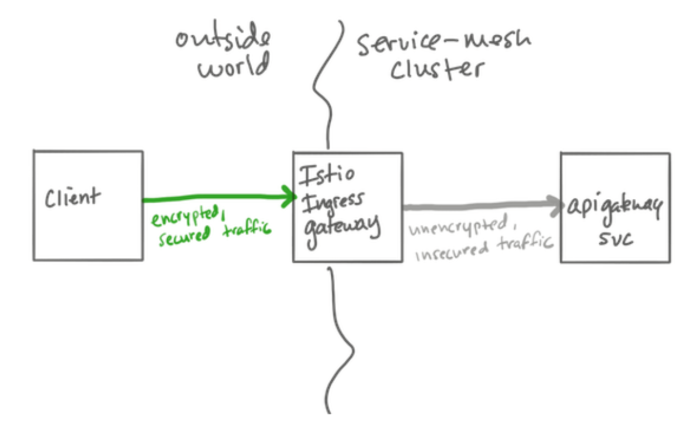
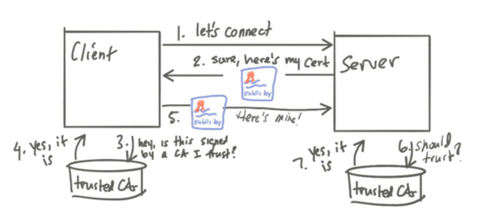

# 04 The edge: Getting traffic into your cluster

## 4.1 Traffic ingress concepts

### 4.1.1 Virtual IPs: simplifying service access

- client -> (query) -> `api.istioinaction.io/v1/products`
- client network stack
    - resolve domain name to ip address (DNS server)
- server side
    - map domain name to virtual IP
    - virtual Ip -> (single instance x) -> reverse proxy

### 4.1.2 Virtual Hosting: multiple services from a single access point

- prd.istioinaction.io & api.istioinaction.io -> same virtual IP
- virtual hosting
    - hosting multiple different services at single entry point
- particular request -> virtual-host group
    - HTTP/1.1: `Host` header
    - HTTP/2: `:authority` header
    - TCP: `SNI(Server Name Indicator)`

---

## 4.2 Istio Gateway
- Ingress gateway (envoy proxy)
    - network-ingress point
    - guarding & controlling access to cluster from outside traffic
    - load balancing
    - virtual-hosting routing
    
### 4.2.1 Specifying Gateway resources  
- Ingress gateway configuration :: `Gateway`
    - service mesh 외부에서 내부로 들어오는 virtual host에 port와 protocol 설정
    ```yaml
    apiVersion: networking.istio.io/v1alpha3
    kind: Gateway
    metadata:
      name: coolstore-gateway
    spec:
      selector:
        istio: ingressgateway           ---> (1)
      servers:
      - port:                           ---> (2)
          number: 80
          name: http
          protocol: HTTP
        hosts:                          ---> (3)
        - "apiserver.istioinaction.io"
    ```
    - (1) : 어떤 Ingress gateway 설정인가
    - (2) : 어떤 port와 protocol 명시
    - (3) : 이 port에 어떤 virtual hosts를 연결할 것인가

- how to check?
```shell script
$ istioctl proxy-config listener -n istio-system
$ istioctl proxy-config route {ingress gateway pod name} -o json  -n istio-system
```

- expose ingress gateway 
    - nodePort
    - loadBalancer
    
### 4.2.2 Gateway routing with Virtual Services
- Ingress gateway configuration :: `VirtualService`
    - `Gateway`를 통해 mesh 내부로 들어올 설정을 했다면 `VirtualService`를 통해 gateway로 들어온 트래픽을 특정 서비스(FQDN)와 매칭 시켜준다.
    ```yaml
    apiVersion: networking.istio.io/v1alpha3
    kind: VirtualService
    metadata:
      name: apigateway-vs-from-gw
    spec:
      hosts:
      - "apiserver.istioinaction.io"
      gateways:
      - coolstore-gateway
      http:
      - route:
        - destination:
            host: apigateway
            port:
              number: 8080
    ```

### 4.2.3 Overall view of traffic flow


### 4.2.4 Istio Gateway vs Kubernetes Ingress  
- istio 초반에는 kubernetes ingress 지원
- kubernetes ingress를 지원하지 않게된 계기
    - k8s ingress는 단순 HTTP 통신에 맞춰져 있다. (port 80 or 443)
    - no common way to traffic routing rules, traffic splitting, or traffic shadowing.
    - 표준이 없기 때문에 벤더들은 설정을 annotation을 활용했다. -> not portable
- 결국, istio는 ingress 따로 구축
    - L4, L5: Gateway
    - L7: VirtualService


---

## 4.3 Securing Gateway traffic
- TLS/SSL termination
- redirect non-TLS to TLS
- mutual TLS

### 4.3.1 HTTP traffic with TLS
- MITM attack (이야기 하고 싶은 것)
- TLS helps to mitigate this attack.
- types
    - outside - ingressgateway
        
    - internal traffic


### 4.3.2 HTTP redirect to HTTPS
```yaml
apiVersion: networking.istio.io/v1alpha3
kind: Gateway
metadata:
  name: custom-coolstore-gateway
spec:
  selector:
    istio: custom-ingressgateway
  servers:
  - port:
      number: 80
      name: http
      protocol: HTTP
    hosts:
    - "apiserver.istioinaction.io"
    tls:
      httpsRedirect: true             << 
  - port:
      number: 443
      name: https
      protocol: HTTPS
    tls:
      mode: SIMPLE
      serverCertificate: /etc/istio/ingressgateway-certs/tls.crt
      privateKey: /etc/istio/ingressgateway-certs/tls.key
    hosts:
    - "apiserver.istioinaction.io"
```

### 4.3.3 HTTP traffic with mutual TLS


### 4.3.4 Serving multiple virtual hosts with TLS
```yaml
apiVersion: networking.istio.io/v1alpha3
kind: Gateway
metadata:
  name: coolstore-gateway
spec:
  selector:
    istio: ingressgateway
  servers:
  - port:
      number: 443
      name: https-apiserver
      protocol: HTTPS
    tls:
      mode: SIMPLE
      serverCertificate: /etc/istio/ingressgateway-certs/tls.crt
      privateKey: /etc/istio/ingressgateway-certs/tls.key
hosts:
    - "apiserver.istioinaction.io"
  - port:
      number: 443
      name: https-catalog
      protocol: HTTPS
    tls:
      mode: SIMPLE
      serverCertificate: /etc/istio/catalog-ingressgateway-certs/tls.crt
      privateKey: /etc/istio/catalog-ingressgateway-certs/tls.key
    hosts:
    - "catalog.istioinaction.io"
```
- how does it know?
    - SNI(Server Name Indication)
        - hand-shake과정 초기에 client가 server에게 어떤 호스트로 접속하는지 알리는 역할
        - multi host의 multi cert를 사용 할 수 있음
        - nginx의 여러 server_name을 사용하는 것과 같은 원리

---

## 4.4 TCP traffic
- When Istio treats the traffic as plain TCP, we do not get as many useful features like retries, request-level circuit breaking, complex routing, etc.
    - Istio cannot tell what protocol is being used
    
### 4.4.1 Exposing TCP ports on the Istio Gateway
- databases, message queues, caches, legacy applications

### 4.4.2 Traffic routing with SNI and TLS

## 4.5 Summary


