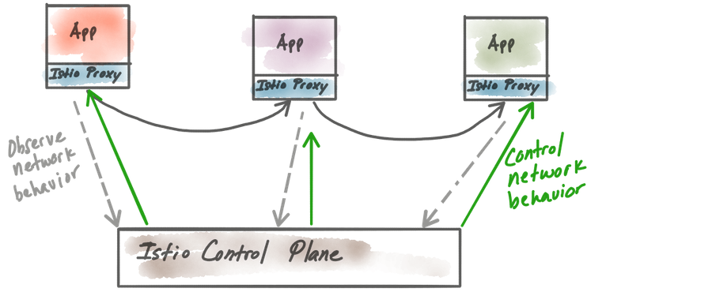
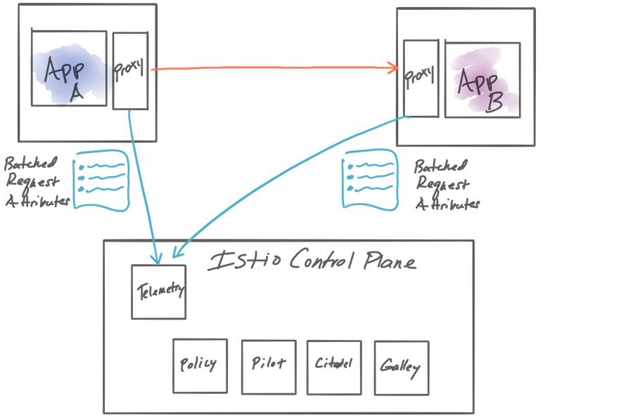
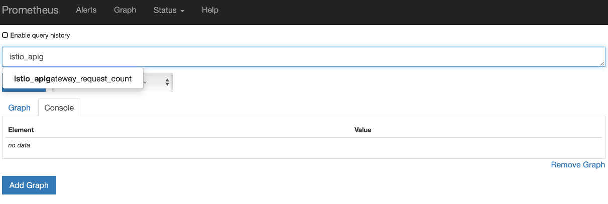
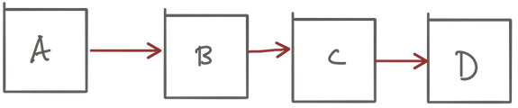
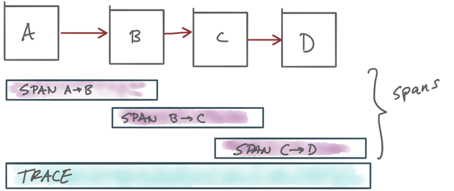
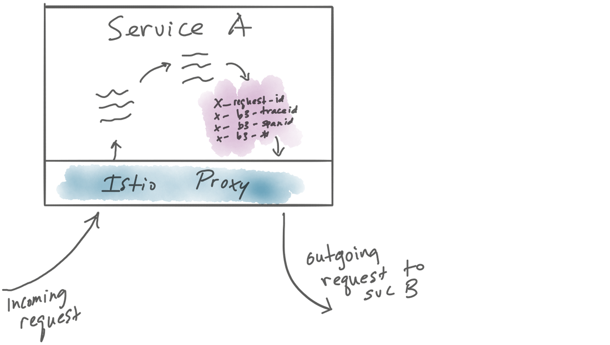

# 7장

Created: Sep 25, 2019 5:36 PM
Updated: Oct 30, 2019 2:16 AM

### 다루는 내용

- 기본적인 요청-기반 메트릭 수집
- 프로메테우스를 통한 메트릭 저장
- 프로메테우스에서 트래킹을 위한 istio에 새로운 메트릭 추가
- 메트릭을 시각적으로 관찰하기 위해 대시보드 생성
- Jaeger를 사용하여 분산 트레이싱 계측
- Kiali로 서비스 메시 시각화

SRE 팀에서 이야기하는 관측가능성

MTTR(Mean Time To Recovery) 개선하는것이 목표

10개이상의 많은 서비스들을 대한 장애 감지, 디버깅을 하는 계측 방법을 다룬다.

## 7.1 observability (관측가능성, 관측성)

observability : 시스템의 외부 시그널과 특성만 가지고 내부 상태를 이해하고 판단하는 수준으로 측정되는 특징

동적으로 관리를 위해서 자동화와 수동제어 기능을 구현해야 함.



- 트래픽 이동(shifting), 탄력성(resilience), 정책 집행(reforcement) 과 같은 제어기능을 구현하는데 도움
- 모든 제어기능은 네트워크 레벨에서 구현됨
    - Istio가 observability 전체를 의미하지 않음 (앱 계측, 네트워크 사용량 계측, 인프라/DB 모니터링)
    - 애플리케이션 수준의 네트워크 계측을 의미함

### 7.1.1 Observability vs Monitoring

모니터링

- signal, telemetry, traces 등을 수집하고 집계하는 행위
- 임계점을 넘어가는 상태에 대한 알림 및 조치
    - 예) DB 디스크 사용량 임계점 초과시 알람 발생 및 통지 → 스토리지 확장 및 추가 행위

모니터링은 관측성의 하위 집합

- 모니터링을 통해 상태를 확인하고 특정 임계치에 대한 알람을 발생하기 위해 메트릭을 수집/집계
- 관측성은 예측 불가능한 모든 장애 가능성을 알 수 없다는것을 전제로 함
    - 예) 특정 user가 장바구니에서 페이먼트 옵션을 선택할때 10초가 걸림
    - 모니터링 측면에서 모든 메트릭 임계값은 정상(디스크 사용량, I/O Queue, 시스템 상태 등)
    - 관측성 측면에서는 지연시간, hops수, 메시지큐, DB
    - 서비스 대기 시간, 메시지 대기열 또는 데이터베이스에 관련된 인프라 홉과 같은 요청 경로를 추적하고 특정 사용자 및 요청에 대해 데이터베이스 쿼리가 실행된 수준까지 파악하는 것

관측성 확보를 위해 세밀한 데이터가 필요함

- 집계보다 중요한건 수집된 데이터를 분석하는 능력
- 문제 발생시 필요한건 고해상도 계측 데이터와 탐색 도구들

### 7.1.2 How Istio helps with observability

Data plane proxy인 Envoy는 request 경로에 위치하여 백엔드(Prometheus, Stackdriver등)으로 보낼수 있음

초당 요청횟수, request latency(백분위수), 실패한 요청횟수 등 request handling, 서비스 상호작용(interaction)과 관련한 중요한 시그널을 포착

동적으로 tracing 관련한 내용을 추가해서 새로운 정보를 확인가능함

OpenTracing 통합을 통한 분산 추적가능

결국, Prometheus, Grafana, Kiali등 시각화와 상태를 확인하는데 도움을 주는 box integration을 제공함

→ 7장은 관측성 기능 다룸(메트릭 수집, 분산 추적, 시각화 등)

## 7.2 Collecting metrics from Istio data plane

https://istio.io/docs/tasks/telemetry/metrics/tcp-metrics/

실습내용 → Makefile error(내용 경로 파일 부재)

```
$ make deploy-apigateway-with-catalog
service/catalog created               deployment.extensions/catalog created
service/apigateway created            deployment.extensions/apigateway created
```
```
$ kubectl exec -it apigateway-67bd5dfd77-g7gcf \
  -c istio-proxy -- curl localhost:15000/stats
```
```
$ kubectl exec -it apigateway-67bd5dfd77-g7gcf -c istio-proxy \
    -- curl localhost:15000/stats | grep cluster.inbound | grep 8080

apigateway.istioinaction.svc.cluster.local.bind_errors: 0
apigateway.istioinaction.svc.cluster.local.internal.upstream_rq_200: 3
apigateway.istioinaction.svc.cluster.local.internal.upstream_rq_2xx: 3
apigateway.istioinaction.svc.cluster.local.internal.upstream_rq_completed: 3
apigateway.istioinaction.svc.cluster.local.lb_healthy_panic: 0
apigateway.istioinaction.svc.cluster.local.lb_local_cluster_not_ok: 0
apigateway.istioinaction.svc.cluster.local.lb_recalculate_zone_structures: 0
apigateway.istioinaction.svc.cluster.local.lb_subsets_active: 0
apigateway.istioinaction.svc.cluster.local.lb_subsets_created: 0
apigateway.istioinaction.svc.cluster.local.lb_subsets_fallback: 0
apigateway.istioinaction.svc.cluster.local.lb_subsets_removed: 0
apigateway.istioinaction.svc.cluster.local.lb_subsets_selected: 0
apigateway.istioinaction.svc.cluster.local.lb_zone_cluster_too_small: 0
apigateway.istioinaction.svc.cluster.local.lb_zone_no_capacity_left: 0
apigateway.istioinaction.svc.cluster.local.lb_zone_number_differs: 0
apigateway.istioinaction.svc.cluster.local.lb_zone_routing_all_directly: 0
apigateway.istioinaction.svc.cluster.local.lb_zone_routing_cross_zone: 0
apigateway.istioinaction.svc.cluster.local.lb_zone_routing_sampled: 0
apigateway.istioinaction.svc.cluster.local.max_host_weight: 0
apigateway.istioinaction.svc.cluster.local.membership_change: 1
apigateway.istioinaction.svc.cluster.local.membership_healthy: 1
apigateway.istioinaction.svc.cluster.local.membership_total: 1
```

### 7.2.1 Pushing Istio metrics into statsD


statd 데모 - Push 방식 →

apigateway 서비스 args 수정으로 재기동

    $ kubectl edit deploy apigateway

    - args:
        - proxy
        - sidecar
        - --statsdUdpAddress
        - statsd:8125
        - --configPath
        - /etc/istio/proxy
        - --binaryPath
        - /usr/local/bin/envoy
        - --serviceCluster
        - apigateway
        - --drainDuration
        - 45s
        - --parentShutdownDuration
        - 1m0s
        - --discoveryAddress
        - istio-pilot.istio-system:15007
        - --discoveryRefreshDelay
        - 1s
        - --zipkinAddress
        - zipkin.istio-system:9411
        - --connectTimeout
        - 10s
        - --proxyAdminPort
        - "15000"
        - --controlPlaneAuthPolicy
        - NONE

### 7.2.2 Pulling Istio Metrics into Prometheus

Prometheus

- metrics-collection engine
- set of related monitoring and alerting tools that originated at SoundCloud
- based on Borgmon at Google

### Push vs Pull

[https://thenewstack.io/exploring-prometheus-use-cases-brian-brazil/](https://thenewstack.io/exploring-prometheus-use-cases-brian-brazil/)


    $ kubectl get pod apigateway-66c7cbff68-z7jp9  \
    -o jsonpath='{.spec.containers[?(@.name=="istio-proxy")]\
    .ports[?(@.name=="http-envoy-prom")].containerPort}'

    $ kubectl exec -it apigateway-66c7cbff68-z7jp9 curl localhost:15090/stats/prometheus
    
    ...
    envoy_cluster_version{cluster_name="outbound|9093||istio-galley.istio-system.svc.cluster.local"} 16933522936099040193
    envoy_cluster_membership_healthy{cluster_name="outbound|9093||istio-galley.istio-system.svc.cluster.local"} 1
    envoy_cluster_max_host_weight{cluster_name="outbound|9093||istio-galley.istio-system.svc.cluster.local"} 1
    envoy_cluster_upstream_rq_pending_active{cluster_name="outbound|9093||istio-galley.istio-system.svc.cluster.local"} 0
    envoy_cluster_lb_subsets_active{cluster_name="outbound|9093||istio-galley.istio-system.svc.cluster.local"} 0
    envoy_cluster_membership_total{cluster_name="outbound|9093||istio-galley.istio-system.svc.cluster.local"} 1
    envoy_cluster_upstream_cx_active{cluster_name="outbound|9093||istio-galley.istio-system.svc.cluster.local"} 0
    envoy_cluster_upstream_rq_active{cluster_name="outbound|9093||istio-galley.istio-system.svc.cluster.local"} 0
    envoy_cluster_upstream_cx_rx_bytes_buffered{cluster_name="outbound|9093||istio-galley.istio-system.svc.cluster.local"} 0
    envoy_cluster_upstream_cx_tx_bytes_buffered{cluster_name="outbound|9093||istio-galley.istio-system.svc.cluster.local"} 0
    envoy_listener_downstream_cx_active{listener_address="10.109.82.141_443"} 0
    ...

Prometheus Configuration

    global:
      scrape_interval: 15s
    scrape_configs:
    
    # Scrape config for envoy stats
    - job_name: 'envoy-stats'
      metrics_path: /stats/prometheus ## path to scrape
      kubernetes_sd_configs: ## Auto Discovery Kubernetes API
      - role: pod
    
      relabel_configs:
      - source_labels: [__meta_kubernetes_pod_container_port_name]
        action: keep
        regex: '.*-envoy-prom' ## Prometheus Ports
      - source_labels: [__address__, __meta_kubernetes_pod_annotation_prometheus_io_port]
        action: replace
        regex: ([^:]+)(?::\d+)?;(\d+)
        replacement: $1:15090
        target_label: __address__
      - action: labelmap
        regex: __meta_kubernetes_pod_label_(.+)
      - source_labels: [__meta_kubernetes_namespace]
        action: replace
        target_label: namespace
      - source_labels: [__meta_kubernetes_pod_name]
        action: replace
        target_label: pod_name

ConfidMap into Prometheus Kubernetes Pod

    apiVersion: v1
    kind: ConfigMap
    metadata:
      labels:
        source: istioinaction
      name: istioinaction-prom
    data:
      prometheus.yml: |-
        global:
          scrape_interval: 15s
        scrape_configs:
    
        # Scrape config for envoy stats
        - job_name: 'envoy-stats'
          metrics_path: /stats/prometheus
          kubernetes_sd_configs:
          - role: pod
    
          relabel_configs:
          - source_labels: [__meta_kubernetes_pod_container_port_name]
            action: keep
            regex: '.*-envoy-prom'
          - source_labels: [__address__, __meta_kubernetes_pod_annotation_prometheus_io_port]
            action: replace
            regex: ([^:]+)(?::\d+)?;(\d+)
            replacement: $1:15090
            target_label: __address__
          - action: labelmap
            regex: __meta_kubernetes_pod_label_(.+)
          - source_labels: [__meta_kubernetes_namespace]
            action: replace
            target_label: namespace
          - source_labels: [__meta_kubernetes_pod_name]
            action: replace
            target_label: pod_name

prometheus-deployments.yaml

    apiVersion: extensions/v1beta1
    kind: Deployment
    ...
      template:
      ...
        spec:
          containers:
          - args:
            - --storage.tsdb.retention=6h
            - --config.file=/etc/prometheus/prometheus.yml
            image: docker.io/prom/prometheus:v2.3.1
            imagePullPolicy: IfNotPresent
            ...
            volumeMounts:
            - mountPath: /etc/prometheus
              name: config-volume
          ...
          serviceAccount: prometheus
          serviceAccountName: prometheus
          volumes:
          - configMap:
              name: istioinaction-prom
            name: config-volume

Envoy는 많은 메트릭을 생성하므로 몇개의 메트릭들은 prune(가지치기) 해야함. 

metrics_relabel_configs

    metric_relabel_configs:
        - source_labels: [ cluster_name ]
          regex: '(outbound|inbound|prometheus_stats).*'
          action: drop
        - source_labels: [ tcp_prefix ]
          regex: '(outbound|inbound|prometheus_stats).*'
          action: drop
        - source_labels: [ listener_address ]
          regex: '(.+)'
          action: drop

### 7.2.3 Visualize Istio metrics with Grafana

그라파나 배포 및 data source 추가

## 7.3 Creating new metrics to send to Prometheus through Istio-telemetry

수집가능한 메트릭은 proxy가 수집하고 사용할수 있는 사전 정의된 메트릭 셋에서 가져옴

실제 프로덕션에서는 사전 정의된 메트릭과 새로운 메트릭을 등록하는것이 일반적임

위에서 수집한 메트릭은 proxy에서 백엔드(프로메테우스, statd) 등으로 push or pull.

많은 메트릭이 있지만 고정된 값이고 쉽게 확장이 불가능함.

A→B로 서비스 호출시  

- proxy는 요청이 시작된 위치, 전송된 위치(B), 요청 경로 등을 메타 데이터 세트로 기록함
- 주기적으로 메타데이터를  control plane(telemetry)으로 전달
- Prometheus 와 같은 백엔드 시스템에서 수집/처리
- Telemetry에서 유연하게 자체 메트릭을 생성 가능



메트릭 생성(적용 안됨)

metric - Istio 속성으로부터 instance 구성

    apiVersion: "config.istio.io/v1alpha2"
    kind: metric
    metadata:
      name: apigatewayrequestcount
      namespace: istio-system
    spec:
      value: "1"
      dimensions:
        source: source.workload.name | "unknown"
        destination: destination.workload.name | "unknown"
        destination_ip: destination.ip
      monitored_resource_type: '"UNSPECIFIED"'

아래걸로 됨

[https://istio.io/docs/reference/config/policy-and-telemetry/templates/metric/](https://istio.io/docs/reference/config/policy-and-telemetry/templates/metric/)

    apiVersion: "config.istio.io/v1alpha2"
    kind: instance
    metadata:
      name: requestsize
      namespace: istio-system
    spec:
      compiledTemplate: metric
      params:
        value: request.size | 0
        dimensions:
          source_version: source.labels["version"] | "unknown"
          destination_service: destination.service.host | "unknown"
          destination_version: destination.labels["version"] | "unknown"
          response_code: response.code | 200
        monitored_resource_type: '"UNSPECIFIED"'

생성된 instance_를 처리할 수 있는 Prometheus _handler 구성(적용 안됨)

    apiVersion: "config.istio.io/v1alpha2"
    kind: prometheus
    metadata:
      name: apigatewayrequestcounthandler
      namespace: istio-system
    spec:
      metrics:
        - name: apigateway_request_count
          instance_name: apigatewayrequestcount.metric.istio-system
          kind: COUNTER
          label_names:
            - source
            - destination
            - destination_ip

instance 를 Prometheus handler 에게 보내는 규칙 지정

    apiVersion: "config.istio.io/v1alpha2"
    kind: rule
    metadata:
      name: apigatewayrequestcountrule
      namespace: istio-system
    spec:
      match: destination.service == "apigateway.istioinaction.svc.cluster.local"
      actions:
        - handler: apigatewayrequestcounthandler.prometheus
          instances:
            - apigatewayrequestcount.metric

apigateway_request_count 메트릭을 prometheus 에서 조회가능



## 7.4 Distributed tracing with OpenTracing



마이크로서비스의 graph를 통해 request 흐름과 관련된 API를 캡처하는 community-driven specification (대부분의 언어의 라이브러리 보유)

### 7.4.1 How does it work

Span - 작업 단위를 나타내는 데이터 콜렉션(시작시간, 종료시간, 작업ID, Tag, Log등 포함)



Spans는 본인의 ID와 부모 ID(Trace ID)를 가지고 있음.

- Jaeger
- Zipkin
- LightStep
- Instana

istio는 위와 같은 분산 추적 엔진에 Spans을 전달하는 것을 담당한다. 

언어별 라이브러리나 어플리케이션별 설정이 별도로 필요 없다.

Request가 오면 HTTP 헤더에 다음과 같은 Zipkin 추적 헤더를 추가한다. 

- x-request-id
- x-b3-traceid
- x-b3-spanid
- x-b3-parentspanid
- x-b3-sampled
- x-b3-flags
- x-ot-span-context



### 7.4.2 Configuring Istio to perform distributed tracing

### 7.4.3 Viewing distributed tracing data

Spans은 Jaeger 또는 Zipkin과 같은 백엔드로 다시 보내지고 확인이 가능하다.

 

### 7.4.4 Limiting tracing apeture

Tracing 수집은 시스템 부하를 줄수 있으므로 빈도(apeture)를 제한 할 수 있다. 

istio-pilot 의 환경변수 PILOT_TRACE_SAMPLIG 을 수정하여 가능함.

1.0부터 100.0까지 샘플링 빈도 수정 가능

    $  kubectl -n istio-system edit deploy istio-pilot
    ...
    containers:
    - args:
      - discovery
      env:
      - name: POD_NAME
        valueFrom:
          fieldRef:
            apiVersion: v1
            fieldPath: metadata.name
      - name: POD_NAMESPACE
        valueFrom:
          fieldRef:
            apiVersion: v1
            fieldPath: metadata.namespace
      - name: PILOT_CACHE_SQUASH
        value: "5"
      - name: GODEBUG
        value: gctrace=2
      - name: PILOT_PUSH_THROTTLE_COUNT
        value: "100"
      - name: PILOT_TRACE_SAMPLING
        value: "50.0"
    ...

특정 request에 대한 추적을 기록하려면 x-envoy-force-trace 사용

```sh
    $  curl -H "x-envoy-force-trace: true"  \
    -H "Host: apigateway.istioinaction.io" \
    http://$GATEWAY_RUL/api/products
```

## 7.5 Visualization with Kiali

핸즈온
